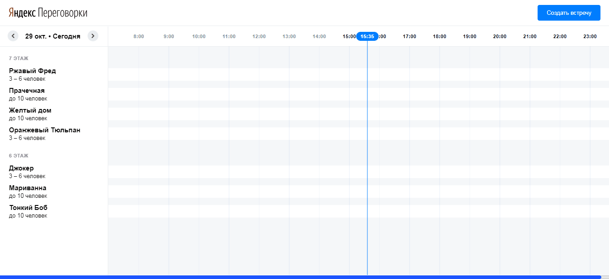

> Одностраничное приложение для создания переговорок

https://yandex-rooms.firebaseapp.com

[![Build status][travis-image]][travis-url]  [![Dependency status][dependency-image]][dependency-url] 

При открытии приложения отображается таблица переговорок. Предполагается, что офис начинает работать с 7 часов, и закрывается в 23:59. Каждый блок таблицы равен одному часу. При клике на свободный блок, открывается форма создания нового события. Дата события, комната и этаж подставляются автоматически, остается лишь правильно заполнить оставшиеся поля.

После создания, появляется попап, который дублирует информацию о событии. Блок с событием окрашивается в серый цвет. При клике на него появляется попап с описанием и кнопка редактирования. Нажав на нее открывается окно редактирования, также появляется возможность удаления события.

## Установка

<table>
  <thead>
    <tr>
      <th>Команда</th>
      <th>Результат</th>
    </tr>
  </thead>
  <tbody>
    <tr>
      <td width="30%"><code>npm install</code></td>
      <td>Установить зависимости</td>
    </tr>
    <tr>
      <td><code>npm run dev</code></td>
      <td>Запустить сборку, сервер и слежение за файлами</td>
    </tr>
     <tr>
      <td><code>npm run build</code></td>
      <td>Собрать проект для продакшена</td>
    </tr>
    <tr>
      <td><code>npm start ЗАДАЧА</code></td>
      <td>Запустить задачу с названием ЗАДАЧА (список задач в <code>package.json</code>)</td>
    </tr>
  </tbody>
</table>

Предполагается, что все команды вы выполняете в bash (для OSX и Linux это самый обычный встроенный терминал, для Windows это, к примеру, Git Bash). В Windows установку пакетов (npm i) нужно выполять в терминале, запущенном от имени администратора.

## Техническое задание 
<a href="https://github.com/deilan-shri-msk-2018/entrance-task-2" target="_blank">Открыть репозиторий</a>

## Используемые технологии

<table>
  <thead>
    <tr>
      <th>Технология</th>
      <th>Описание</th>
    </tr>
  </thead>
  <tbody>
    <tr>
      <td><a href="https://ru.vuejs.org/index.html">Vue.js</a></td>
      <td>Основной фреймворк для разработки интерфейса приложения</td>
    </tr>
    <tr>
      <td><a href="https://vuex.vuejs.org/ru/">Vuex</a></td>
      <td>Центральное хранилище данных для всех компонентов приложения</td>
    </tr>
    <tr>
      <td><a href="http://momentjs.com/">moment.js</a></td>
      <td>Библиотека для работа с датами и временем</td>
    </tr>
  </tbody>
</table>

Также использовались сторонние компоненты для выбора участников и даты в календаре.

## Поддержка браузерами

|  IE / Edge |  Firefox |  Chrome |  Safari|  Opera |  Yandex |
| --------- | --------- | --------- | --------- |--------- | --------- |
| IE11, Edge|Последние 2 версии|Последние 2 версии| 9+ |Последние 2 версии| Последние 2 версии |

## Таски на будущее
- [ ] Покрыть тестами
- [ ] Добавить сохранение переговорок в localStorage или любое другое хранилище
- [ ] Разработать алгоритм выдачи свободных переговорок

[travis-image]: https://travis-ci.org/webistomin/yandex-test.svg?branch=master
[travis-url]: https://travis-ci.org/webistomin/yandex-test
[dependency-image]: https://david-dm.org/webistomin/yandex-test/dev-status.svg
[dependency-url]: https://david-dm.org/webistomin/yandex-test

